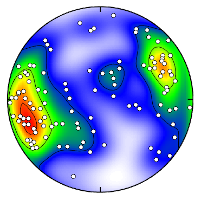

# SphereContour
Code for plotting and automatic contouring of spherical orientation data, including Schmidt (equal-area) and stereographic (equal-angle) plots from Vollmer (1995). Additional files include example data files. 

---

## Citation
This repostory contains C, Pascal, and MATLAB implementations of the algorithm presented in:

__Vollmer, F.W., 1995. C program for automatic contouring of spherical 
orientation data using a modified Kamb method: Computers & Geosciences, 
v. 21, n. 1, p. 31-49.__

which should be cited by publications using this code, algorithm, or derivative 
works, to produce figures or other content. 

The C and Pascal code is complete but not updated for current systems as it is superseded by [Orient](https://vollmerf.github.io/orient). The MATLAB script should run on current MATLAB and Octave software.

## License
See [LICENSE](LICENSE.md) and [CITATION](CITATION.md) for license and citation information.

## Download

[SphereContour](https://github.com/vollmerf/spherecontour)

## Related Software
The program [Orient](https://vollmerf.github.io/orient) by this author is free software that includes this functionality, and numerous additional options. It runs on Macintosh, Windows, and Linux platforms. 

--- 

[Home](https://vollmerf.github.io/) | [Software](https://vollmerf.github.io/software/) | [Orient](https://vollmerf.github.io/orient/) | [EllipseFit](https://vollmerf.github.io/ellipsefit/) | [Antevs](https://vollmerf.github.io/antevs/)

| 6 Aug 2020 |